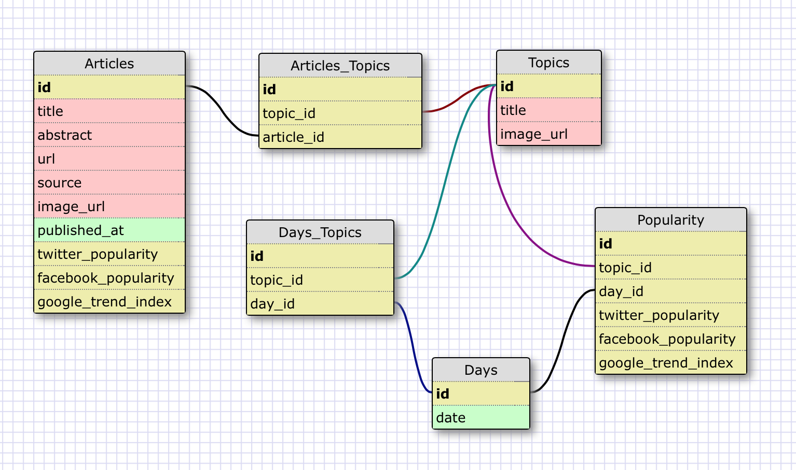
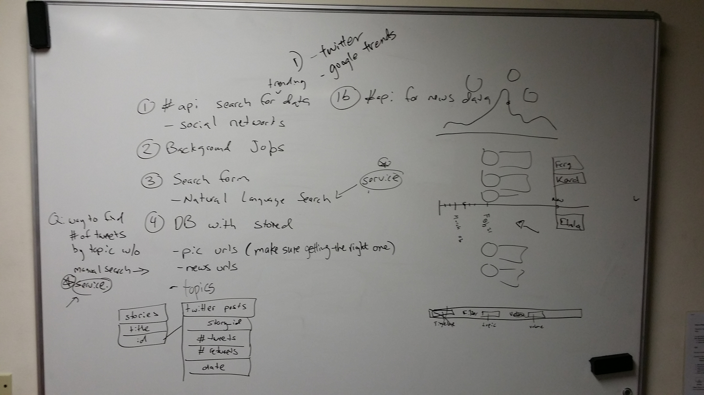
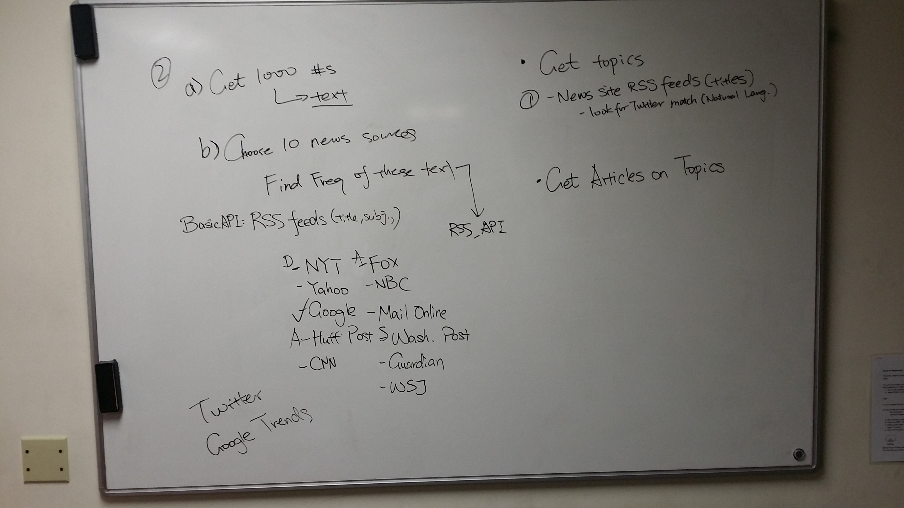
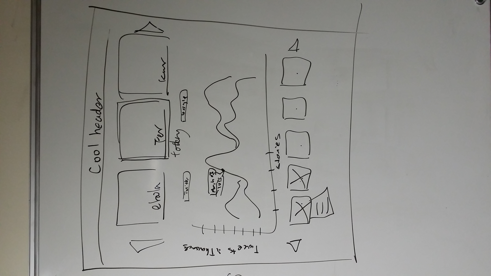

News Ketchup
============

**News Ketchup's** purpose is to help users of the app rid themselves of moments of being left out of a conversation due to ignorance of today's trending news topics.

### Screenshots:

### System Requirements
- Ruby 2.0.0
- Rails 4.1.6
- Postgres 9.3.5
- Internet access

### External APIs & Libraries:
#### APIs:
-	[New York Times](http://api.nytimes.com/svc/search/v2/)
-	[USA Today](http://api.usatoday.com/)
-	[Washington Post](http://api.washingtonpost.com/trove/v1/)
-	[Guardian News](http://content.guardianapis.com/)

#### RSS Feeds:
- [ABC News](http://feeds.abcnews.com/abcnews/topstories)
- [BBC News](http://feeds.bbci.co.uk/news/world/us_and_canada/rss.xml)
- [CBS News](http://www.cbsnews.com/latest/rss/main)
- [CNN News](http://rss.cnn.com/rss/cnn_topstories.rss)
- [Fox News](http://feeds.foxnews.com/foxnews/most-popular)
- [NBC News](http://feeds.nbcnews.com/feeds/topstories)
- [NPR News](http://www.npr.org/rss/rss.php)
- [Reuters News](http://feeds.reuters.com/reuters/topNews)

#### Social Media Feeds:
- [Twitter API](https://dev.twitter.com)
- [Facebook](http://graph.facebook.com)

#Schema:

<!-- # User Stories

* I want to be able to see the top 5 trending topics for today
	* I would like to be able to see quick info about each trending topic
		* picture
		* topics
		* stats
		* most recent articles with heading, lead, quick stat, source
	* I would like to be able to see previous days top topics
	* I want to be able to interact with a timeline that will give statistics and news articles over time on a selected topic
		* I want the entire timeline to be visible with aggregated statistics
			* number of tweets or retweets
			* number of articles on major news sources
			* ...
		* I want to be able to see specific stats for each day on the graph when I hover over it
		* I want to be able to see relevant news articles for a specific day when I click on the graph
			* picture
			* topics and lead
			* quick stat
			* source
			* link to full article
		* I would like to be able to cycle through relevant news articles for each day
		(*) I would like to be able to upvote or downvote an article depending on relevance
		(*) forward tracking of topics
		(*) default articles when a topic is first chosen should be over the entire timeline -->

